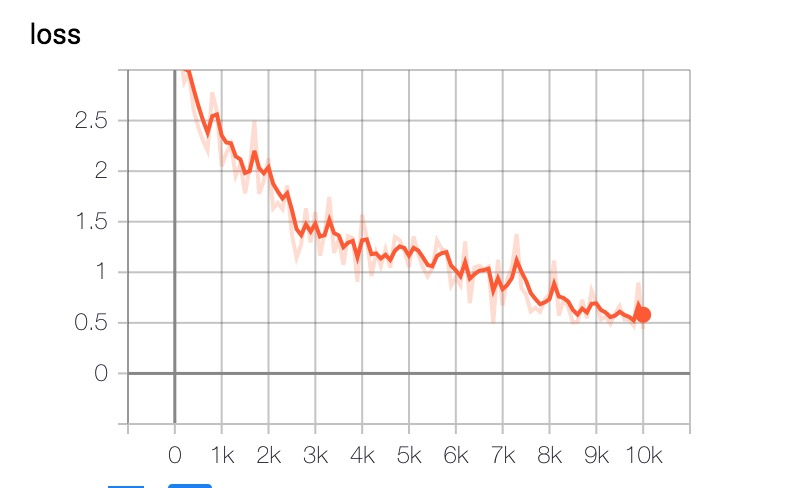
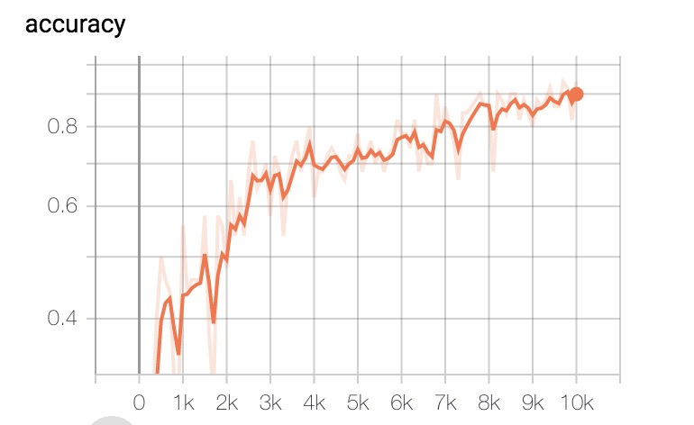

# music-genres-classification
## Abstract
The demo is to develop a deep learning model that will identify the genres from music.The model adopt Inception-ResnetV2 from slim.And the datasat used GTZAN Music Genre Dataset, which is a collection of 1000 songs in 10 genres, is the most widely used dataset.If you wanna train a model by yourself, download it from [GTZAN dataset](http://opihi.cs.uvic.ca/sound/genres.tar.gz).

Below table shows the result on test set:

Accuracy | Value
--------- | ---------
Top-1 | 69.70%
Top-5 | 92.50%

Below picture shows the training-process on tensorboard:
<p align="center">
   <br />
  <em> Loss </em>
</p>
<p align="center">
   <br />
  <em> Accuracy</em>
</p>

## Pre-Trained Testing

* Step1: download [pre_trained](https://pan.baidu.com/s/1Pg7UH5rj_xCv77Wz4sCy_A) model,and put it into `models/` folder.
* Step2: test by executing the following command:
```python 
python test.py
```

## Training

* Step1: download Dataset GTZAN,and put it into `GTZAN/` folder.
* Step2: create the tfrecords by executing the following command:
```Bash 
usage: create_data_to_train.py [-h] [--data_path DATA_PATH]
                               [--train_path TRAIN_PATH]
                               [--test_path TEST_PATH] [--test_size TEST_SIZE]
                               [--aug AUG]
```
```Bash
optional arguments:
  -h, --help            show this help message and exit
  --data_path DATA_PATH
                        data_sets path.
  --train_path TRAIN_PATH
                        train tfrecords save path.
  --test_path TEST_PATH
                        test tfrecords save path.
  --test_size TEST_SIZE
                        Proportion of test data that between [0, 1]
  --aug AUG             the size of data sets up to (arg) times as original. 1
                        means not augmentation.                        

```
* Step3: train the model by executing the following command:
```Bash 
usage: train.py [-h] [--train_data TRAIN_DATA] [--decay_rate DECAY_RATE]
                [--global_steps GLOBAL_STEPS] [--decay_steps DECAY_STEPS]
                [--learning_rate LEARNING_RATE] [--eval_step EVAL_STEP]
                [--batch_size BATCH_SIZE] [--model_path MODEL_PATH]
                [--summary_path SUMMARY_PATH] [--load_model LOAD_MODEL]
```

```Bash           
optional arguments:
  -h, --help            show this help message and exit
  --train_data TRAIN_DATA
                        train_data path.
  --decay_rate DECAY_RATE
                        learning rate decay rate.
  --global_steps GLOBAL_STEPS
                        global steps
  --decay_steps DECAY_STEPS
                        learning rate decay steps.
  --learning_rate LEARNING_RATE
                        learning rate.
  --eval_step EVAL_STEP
                        evaluation steps.
  --batch_size BATCH_SIZE
                        batch size.
  --model_path MODEL_PATH
                        tensorflow model path.
  --summary_path SUMMARY_PATH
                        tensorflow summary path.
  --load_model LOAD_MODEL
                        whether you wish to continue training.
```

## Testing

Run the following command to simple test the test-dataset:
```python 
python test.py
```

## References

[1] https://github.com/deepsound-project/genre-recognition


